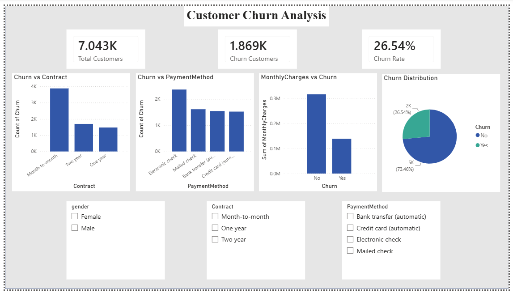

# 📊 Customer Churn Analysis

## 📌 Project Overview

This project analyzes customer churn data to identify the key factors influencing customer retention. The analysis was performed using Excel, SQL, Python, and Power BI to generate business insights and interactive dashboards.

---

## 🎯 Business Objective

The objective of this project is to understand customer churn behavior, identify high-risk customers, and provide insights that help improve customer retention and business decision-making.

---

## 🛠️ Tools & Technologies

- Microsoft Excel
- MySQL
- Python
- Power BI
- GitHub

---

## 📂 Repository Structure

```
Customer-Churn-Analysis/
│
├── Dataset/
├── Excel/
├── SQL/
├── Python/
├── PowerBI/
├── Dashboard/
├── Images/
├── README.md
└── LICENSE
```

---

## 📊 Dataset

The dataset contains customer information such as:

- Customer ID
- Gender
- Tenure
- Contract
- Payment Method
- Monthly Charges
- Total Charges
- Churn Status

---

## 📈 KPIs

- Total Customers
- Churn Customers
- Active Customers
- Churn Rate

---

## 📊 Analysis Performed

### Microsoft Excel

- Data Cleaning
- KPI Calculation
- Pivot Tables
- Pivot Charts
- Customer Analysis

### SQL

- Total Customers
- Churn Customers
- Active Customers
- Churn Rate
- Contract-wise Analysis
- Payment Method Analysis
- Monthly Charges Analysis
- Customer Tenure Analysis

### Python

- Data Loading
- Churn Distribution
- Contract Analysis
- Monthly Charges Analysis
- Tenure Analysis
- Data Visualization

### Power BI

Interactive Dashboard including:

- KPI Cards
- Churn by Contract
- Churn by Payment Method
- Monthly Charges vs Churn
- Churn Distribution
- Interactive Slicers

---

## 📷 Dashboard Preview

### Customer Churn Dashboard



---

## 💡 Key Business Insights

- Month-to-month contract customers have the highest churn.
- Electronic Check is the most common payment method among churned customers.
- Customers with higher monthly charges are more likely to churn.
- Overall churn rate is approximately 26.5%.
- Long-term contracts are associated with better customer retention.

---

## 🚀 Future Improvements

- Customer Churn Prediction using Machine Learning
- Interactive Executive Dashboard
- Customer Segmentation
- Automated Reporting

---

## 👨‍💻 Author

**Sasikumar**

Aspiring Data Analyst

### Skills

- Excel
- SQL
- Python
- Power BI
- Data Cleaning
- Data Visualization
- Business Intelligence

### Connect with Me

- GitHub: https://github.com/seerasasikumar
- LinkedIn: https://www.linkedin.com/in/seerasasikumar

---

⭐ If you found this project useful, feel free to explore the repository and connect with me.
